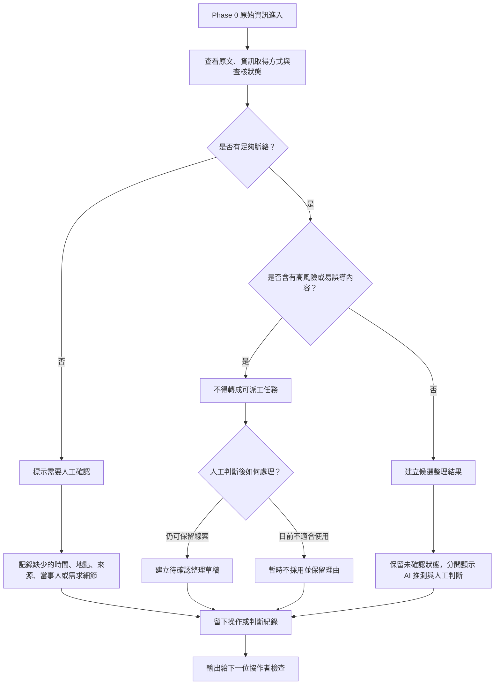

# 資訊流程設計

> 這份文件由 Codex 依 `release-packs/02-flow-design-kit`、訪談摘要與需求取捨先產生草稿。流程合理性仍需要學員用 Mermaid 預覽並人工確認。

## 我的 v1 目標

- 我優先服務的使用者：資訊整理者。
- 這個使用者最想完成的事：從 Phase 0 原始資訊中分清楚原文、整理草稿、AI 推測、人工判斷與查核狀態，並留下不能直接變成任務的原因。
- 我最想避免的錯誤：讓未確認、轉述、地點模糊或時間不明的資訊看起來像已確認或可行動任務。

## 自然語言流程描述

```text
原始資訊進入 v1 工作台後，資訊整理者先查看原文、資訊取得方式與目前查核狀態。

整理者先判斷這筆資訊是否保留了足夠脈絡，例如時間、地點、需求內容、來源與當事人關係。若脈絡不足，就先標示為需要人工確認，並記錄缺少哪些資訊。

如果資訊包含轉述、來源不明、地點不清、時間不明、涉及個資或可能影響現場行動，工作台不能把它轉成可派工任務，只能建立「待確認整理草稿」或「暫時不採用」紀錄。

如果資訊足以形成候選整理結果，整理者可以建立候選結果，但候選結果仍必須保留未確認狀態，並把 AI 推測和人工判斷分開顯示。

每次人工判斷都要留下紀錄：誰做了判斷、依據什麼原文、保留哪些疑點、為什麼不能直接變成任務，以及下一位協作者應該確認什麼。
```

## Mermaid 流程圖

請用 VS Code 預覽，確認流程圖能正常顯示。



## 人工確認點

- 判斷原始資訊是否有足夠脈絡，不能只靠 AI 自動判斷。
- 判斷轉述、來源不明、地點不清、時間不明、涉及個資或可能影響現場行動的資訊是否只能先保留為待確認。
- 判斷 AI 產生的摘要、候選分類與下一步建議是否補了原文沒有的內容。
- 判斷某筆資訊要建立待確認整理草稿，或暫時不採用並保留理由。

## 不能自動處理的分支

- 不能讓 AI 自動把未確認資訊轉成可派工任務。
- 不能讓 AI 自動決定資訊是否為真。
- 不能讓 AI 自動補真實地址、電話、人物、地點或現場判斷。
- 不能把所有輸入都強迫變成候選結果；脈絡不足或高風險資訊可以只留下疑點與暫不採用理由。

## 操作或判斷紀錄

- 建立待確認整理草稿時，記錄依據的原文、人工判斷、AI 推測與仍待確認的問題。
- 暫時不採用資訊時，記錄不採用原因，避免下一位協作者誤以為資料消失。
- 修改 AI 候選整理時，記錄修正了哪些推測，以及修正理由。
- 每個輸出都要能回答「誰做了什麼判斷」和「為什麼不能直接變成任務」。

## 我檢查後修正了什麼

- 原本：流程可能只寫「資訊足夠就建立候選結果」，沒有處理高風險但看似完整的資訊。
- 修正後：在流程圖中加入「是否含有高風險或易誤導內容？」與「不得轉成可派工任務」分支。
- 為什麼：訪談摘要提到來源像公告或現場回報時，仍可能被誤認為可信或可行動；流程必須避免把看似完整的未確認資訊包裝成任務。

## 我仍不確定的流程點

- 「不可行動」應該是一個醒目狀態，還是由多個原因組合出來。
- 資訊整理者與行動者是否共用同一個輸出畫面，還是需要不同視角。
- 人工確認紀錄要記到多細，才足以幫助下一位協作者而不造成填寫負擔。
